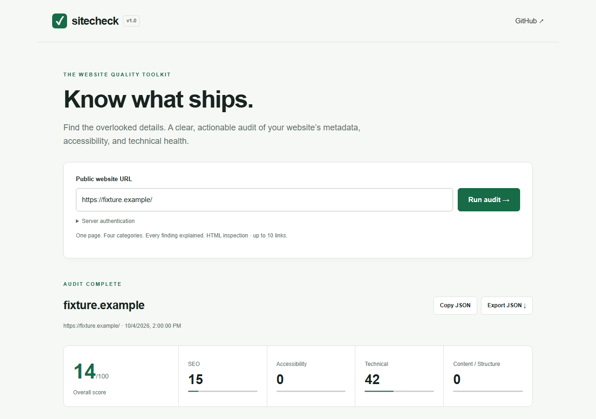

# Sitecheck

**Know what ships.** A transparent website auditor for developers: actionable SEO, accessibility, technical, and content findings from a public URL.

[](LICENSE)

Sitecheck inspects one page and a bounded sample of its links. Every rule includes evidence, an explanation, and a concrete recommendation. Use the terminal, consume the typed engine, or run the optional Next.js dashboard.

## Screenshot

<!-- Screenshot placeholder: replace with a current dashboard capture after UI changes. -->



The screenshot shows the deliberately flawed test fixture, not a live website. [Mobile view](docs/screenshots/dashboard-390.png). Replace this screenshot after UI changes using `node scripts/verify-dashboard.mjs` while the local dashboard is running.

## Features

- Metadata: title and description length, canonical, robots directives, Open Graph, Twitter/X, favicon, viewport, language, and structured data detection.
- Accessibility heuristics: alt attributes, accessible link and button names, detectable form labels.
- Structure: heading outline, primary headings, landmarks, duplicate IDs, and sampled link health.
- Technical: HTTP status, insecure resources, DOM size, observed response timing, sitemap and robots discovery.
- Optional Playwright inspection for rendered HTML and console errors.
- Text and versioned JSON reports; CI score thresholds; a responsive dashboard with severity filters and JSON export.
- DNS-pinned public-only requests, bounded response sizes, request timeouts, redirect checks, and explicit skipped checks.

These are practical heuristics, **not** a WCAG conformance claim, search ranking prediction, Lighthouse score, or Core Web Vitals measurement. Browser accessible-name detection is an approximation and does not implement the full accessibility tree algorithm.

## Installation

Requires Node.js 22 or newer and pnpm 10.28.2. v1 is distributed from source and GitHub releases; npm publication is planned. Do not assume `npm install -g sitecheck` installs this project.

```sh
git clone https://github.com/bynowak/sitecheck.git
cd sitecheck
corepack enable
corepack prepare pnpm@10.28.2 --activate
pnpm install --frozen-lockfile
pnpm build
```

Run from the checkout:

```sh
pnpm sitecheck https://example.com
pnpm sitecheck https://example.com --format json
pnpm sitecheck https://example.com --output report.json
pnpm sitecheck https://example.com --max-links 30 --fail-under 80
```

For the bare `sitecheck` command, add `packages/cli/dist` to your PATH (Windows: call `node packages/cli/dist/index.js`), or link the CLI package with `pnpm --dir packages/cli link --global` after configuring pnpm's global bin directory.

```sh
sitecheck https://example.com
sitecheck https://example.com --format json
sitecheck https://example.com --output report.json
```

Output files are created exclusively: Sitecheck refuses to overwrite an existing file. `.json` selects JSON automatically unless `--format` is explicitly supplied. Exit codes: `0` successful audit, `1` score below `--fail-under`, `2` invalid input or operational failure. Findings alone do not change the exit code.

### Browser inspection

```sh
cd packages/engine
pnpm exec playwright install chromium
cd ../..
pnpm sitecheck https://example.com --browser
```

Chromium is optional in HTML mode. Browser mode uses a fresh context, blocks service workers, WebSockets, non-GET requests, and unsupported resource types, and limits intercepted requests to 100. Resources and GET API calls use the same public-only transport. Client rendering gets a bounded network-idle wait. This intentionally does not reproduce authenticated applications, state-changing APIs, streaming, or all navigation behavior. Blocked resources can produce console errors. JavaScript executes locally: use an isolated container/VM for untrusted sites. The dashboard uses HTML mode only.

## Scoring

Rules have stable IDs, category, severity, status (`pass`, `fail`, `skip`), explanation, recommendation, and bounded evidence. Weights: error **5**, warning **2**, info **1**.

Each category score = `round(100 × passed weight / evaluated weight)`. Skipped checks are excluded. An unevaluated category is `null`. The overall score is the rounded mean of evaluated category scores. Empty input scores 0. Each rule is counted once regardless of the number of affected elements. A skipped or limited check is not proof of health; inspect coverage and evidence alongside the score.

SEO and accessibility heuristics evolve; compare reports from the same version. Missing robots meta is a low-priority review item: browsers normally permit indexing when it is absent. Title/description lengths and the 1,500-element DOM threshold are documented heuristics.

## Web app setup

```sh
pnpm dev
```

Open `http://localhost:3000`. Development permits local use without an API token. For production, copy `apps/web/.env.example` to `apps/web/.env.local`, set a randomly generated `SITECHECK_API_TOKEN`, then:

```sh
pnpm build
pnpm --filter @sitecheck/web start
```

Expand **Server authentication** in the dashboard and enter the token. It stays in component memory; it is never persisted or embedded in the build. Production refuses audit requests when the token is unconfigured. Maximum two concurrent audits per server process; up to ten links per web audit. Deploy behind TLS, authentication, shared rate limits, egress filtering, and request/body limits. Long-running audits need a Node server; short-lived serverless runtimes may terminate them. No browser or external credential is needed for the dashboard.

## Architecture

```text
packages/engine/   Typed audit API, security-aware transport, HTML rules, scoring
packages/cli/      Commander interface, text/JSON output, exit behavior
apps/web/         Next.js dashboard and authenticated Node API
tests/            Deterministic fixtures, rule and orchestration tests
.github/          CI, release workflow, contribution templates
```

The engine does not import the CLI or UI. Its ESM exports and declaration files support a later independent npm release.

```ts
import { audit } from '@sitecheck/engine';

const report = await audit('https://example.com', {
  maxLinks: 20,
  timeoutMs: 10_000,
  browser: false,
});
console.log(report.score, report.findings);
```

JSON has `schemaVersion: 1`, requested/final URLs, timestamp, mode, overall/category scores, metrics, findings, and limitations. Evidence may include page content and URLs; review reports before sharing.

## Development and testing

```sh
pnpm install --frozen-lockfile
pnpm typecheck
pnpm test
pnpm lint
pnpm build
pnpm format
```

`typecheck` builds engine declarations before checking consumers. Tests use local HTML fixtures and mocked transport; no public website, DNS service, or browser installation is required. Integration tests cover link behavior and rendered-snapshot selection. CI runs on Linux and Windows. See [CONTRIBUTING.md](CONTRIBUTING.md) for rule design and pull request guidance.

## Security

Only credential-free HTTP(S) URLs on standard ports are accepted. All DNS answers must be public, including redirect destinations. The selected answer is pinned to the connection to prevent DNS rebinding. Loopback, private, link-local, multicast, reserved, and IPv4-mapped private addresses are rejected. Responses are capped at 2 MB and redirects at five. No cookie jar or authentication headers are forwarded to audited sites.

Checks cannot defeat a public server that proxies to its own private network. Use egress rules and process isolation for hosted services. Reports may contain untrusted HTML snippets; the UI renders them as text. Read [SECURITY.md](SECURITY.md) before hosting this on a public endpoint.

## Contribution guidelines

Small, tested changes are welcome. Open a focused issue, explain expected behavior, and include reproducible fixtures. Use conventional commit messages and keep scoring changes explicit. See [CONTRIBUTING.md](CONTRIBUTING.md) and [CODE_OF_CONDUCT.md](CODE_OF_CONDUCT.md).

## Roadmap

- Publish engine and CLI packages to npm with provenance.
- Full accessible-name computation and optional dedicated accessibility engine integration.
- Multi-page crawling with robots policy, budgets, and cancellation.
- Baseline comparisons and machine-readable JSON schema distribution.
- Isolated browser worker deployment and shared hosted-service rate limits.
- Localization and configurable rule policies.

## Releases and license

See [CHANGELOG.md](CHANGELOG.md) and [docs/RELEASING.md](docs/RELEASING.md). MIT licensed; see [LICENSE](LICENSE). Sitecheck sends no audit telemetry and stores no reports. Next.js has its own build telemetry; set `NEXT_TELEMETRY_DISABLED=1` to disable it (included in the example environment).
